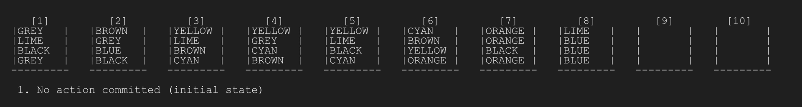

# Water Sort Puzzle
An implementation of the Breadth First Search algorithm for playing the "Water Sort" puzzle game.


* [Rules of the Game](#rules-of-the-game)  
* [Features](#features)  
* [Setup](#setup)  

---

### Rules of the Game
* Each state of the puzzle consists of $N$ bottles with 4 mL capacity each (total space: $4N$ mL)
* A total of $N - 2$ different colored liquids are present with 4 mL of each one being dispersed accross different bottles (total liquids: $4\times(N-2)$ mL)
* Initially, the colored liquids spawn randomly, filling up the $N - 2$ first bottles and leaving the last 2 empty.
* We can choose to pour from bottle $i$ to bottle $j$ if and only if a. the two bottles have the same color on their top (or bottle $j$ is empty) AND b. there is enough space in the $j$-th bottle to pour all of the continouous mL of the same color situated on the top of the $i$-th bottle (transition operator).
* Puzzle is solved when a. two bottles remain empty AND b. each bottle has all 4 mL of the same color's liquid.

<p align="center">
  
  <br>
  <i>A preview of the project's execution for 10 bottles.</i>
</p>

---

### Features
* A random initial state is created which is the root of the search space. Based on every possible allowed transition, a new child state is generated. Thus, the search space is represented as a tree.
* The Breadth-First Search (BFS) algorithm was implemented for finding a sequence of transitions from the initial state to a victorious state (defined as described above). BFS is a blind search algorithm and has the following characteristics:
  - It is sound, complete and optimal
  - Memory complexity is $\mathcal{O}(|S|)$, where $S$ is the set of all states (state space)
  - Runtime complexity is $\mathcal{O}(b|S|)$, where $b$ is the branching factor (average number of children of each state).
* Implementation uses low-level representations of data and static values where possible. This ensures maximum state compression as to make the project's execution feasible, as with every added bottle the search space grows exponentially bigger.
* Allowed number of bottles is $2 < N < 18$. However, it is still advised that $N \leq 10$ is used as $10 < N \leq 12$ is very demanding in memory and execution time, and $N > 12$ is practically unfeasible for any desktop computer.

---

### Setup
* **Clone the project**
  ```
  git clone https://github.com/DimYfantidis/AI_Water_Sort.git
  ```
* **To configure the project for the GCC compiler (supports only GCC ver.7 and above):**
  1. Check the installed compiler's version; it must be $\geq$ 7.0.0
      ```
      g++ --version
      ```
  2. Compile the project
      ```
      g++ -std=c++17 -O3 src/main.cpp src/Bottle.cpp src/MemoryPool.cpp -Iinclude -o ai_water_sort
      ```
  3. Launch project:
      ```
      ./ai_water_sort
      ```
* **To configure the project for Visual Studio (MSVC):**
  1. Navigate to the `build` directory:
      ```
      cd ./build
      ```
  2. Build with CMake:
      ```
      cmake ..
      ```
  3. Open the main solution, `./build/ai_water_sort.sln`, using Visual Studio.
  4. Set the `ai_water_sort` project as main solution
  5. Run the program (Ctrl + F5)
* **To change the number of bottles:**
  1. Change the `BOTTLES_N` variable found at the top of the `main.cpp` file (defaults to 8)
      ```C++
      constexpr static size_t BOTTLES_N = static_cast<size_t>(8);
      ```
  2. Build again before executing the project.
